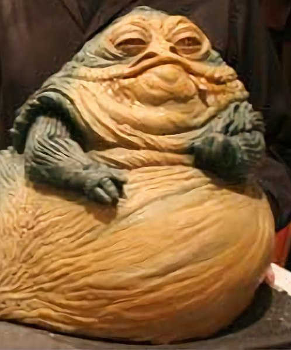

Today we are going to talk about running some basic statistics in R.

```{r}
library(tidyverse)
library(plotly)
library(cowplot)
```

Usually, when I want to run stats on a thing, I start with some basic descriptive stats. Fortunately we did this last week with the starwars dataset, so lets jump back in.

```{r}
data(starwars)
```

Lots of statistics are applied to continuous variables. Lets take a look at the relationship between height and mass.
I'm going to make an interactive plot with `ggplotly` so we can mouse over points and see them better.

Here I included a name and spec variable, but didn't map them to anything. Thats so you can see them when you mouse over them.
```{r}
hmPlot <- starwars %>% ggplot(aes(x = height, y = mass, name = name, spec = species)) + geom_point() + theme_cowplot()
ggplotly(hmPlot)
```

Woah dude. One character is anomalously heavy. 
Mouse over the outlier so you can see who it is.




Jabba is probably going to screw up all of our stats, lets focus on the relationship of all of the other characters by removing him.

```{r}
starwars01 <- starwars %>% filter(!str_detect(name, "Jabba")) # Complecated syntac because I can't spell the rest of his name
```

```{r}
hmPlot01 <- starwars01 %>% ggplot(aes(x = height, y = mass, name = name, spec = species)) + geom_point() + theme_cowplot()
ggplotly(hmPlot01)
```

So here's our relationship. It looks sort of, but not reeally linear, which makes sense, there are lots of species in the galaxy.

Sometimes when we do stats, the stats like to imagine normally distributed data.

```{r}
starwars01 %>% pivot_longer(cols = mass:height, names_to = "measurement", values_to = "value") %>% 
  ggplot(aes(x = value)) + facet_wrap(measurement~.) + geom_histogram()
```

Hmm. Sort of.

See if you can figure out what I did above. 

Lets see if height and width are correlated.

```{r}
cor.test(starwars01$height, starwars01$mass, method = "pearson")
cor.test(starwars01$height, starwars01$mass, method = "spearman")
```

Here are a parametric and non-parametric correlation test. The values I usually think about are cor (pearson), which is the R value, or rho(spearman) which is its "rho" which is a lot like an R value.

Numbers closer to 1 are more  positively correlated, closer to -1 are more  negatively correlated, closer to 0 are not correlated. 

There is a p-value for both of these, which is essentially the probability that if all of the assumptions of the model hold, the true R or rho value is zero.

# Regressions
Regressions are also pretty popular with the kids these days. Lets do one!
Lets see how well `height` explains `mass`

```{r}
mod <- lm(mass ~ height, data = starwars01)
summary(mod)
```

Lets look at what this tells us.
Residuals are essentially the distance of each point from the models prediction. The one that is farthest below is ~ -39 too low, the highest above is ~ 57 and the median and first and third quartiles are also shown.

Coefficients are often what you care about. The estemate tells us about the slope and intercept of the linear regression. These values basically say our model looks like this

mass = -32.5 + 0.62 * height

We don't know the true values of these paramters, so the standard error gives us an idea of the ranges of the two. T-value is the test score to see how good those are, band the p-value tells you if the answer is statistically significant.

4.02 x 10^-12 < 0.002 so it the height value gets a bunch of stars after it. I usually don't make too much of the p value of the intercept.

Residual standard error is the standard deviation of the residuals, according to the internet.
56 degrees of freedom is calculated as our sample size, minus the complexity of the model.  We have 58 characters, but we loose one DF for the intercept and another for the height varaible that we are using.

There is also an R^2, and adjusted R^2 which gets smaller as the model gets more complicated, and a p-value for the whole model.

## Residuals
Linear models like to assume that the residuals are normally distributed. We want to make sure that no person is really affecting our model too much. We can plot the model to do this.

```{r}
plot(mod)
```

## Other way of looking at output data

the `broom` package gives a nice matrix version of model results

```{r}
library(broom)
tidy(mod)
```

Lets see how well our model's predictions compare to the actual data.

We can use the predict function to generate some predictions

```{r}
# Make a data frame containing all of the possible heights, from the shortist to tallest character
predPreDf <- tibble(
  height = min(na.omit(starwars01$height)): max(na.omit(starwars01$height))
)

# for each height, predict the mass
PredMass <- predict(mod, predPreDf) # predict requires a model, mod, and a data frame with the predictors in it. Our only predictor is height, so its just a data frame with one thing

# Stick the range of heights and predicted masses together into a data fraeme
predDf <- tibble(height = predPreDf$height, mass = PredMass)

# plot the original data
starwars01 %>% ggplot(aes(x = height, y = mass)) + geom_point() +
  # plot the predicted values, notice that I include the predicted data in the "data" argument below
  geom_path(aes(x = height, y = mass), data = predDf, color = "darkgreen")
```


# Models with categorical variables
There are a lot of species right now, but most of them only have a few characters. I'm interested in looking at things that differentiate humans from other species. So lets make a new column that indicates whether a character is human

```{r}
starwars02 <- starwars01 %>% mutate(isHuman = ifelse(species == "Human", "Yes", "No"))
```

Lets see if humanity is a reasonable predictor of a characters' mass.

First, lets plot the two against eachother

```{r}
ggplot(aes(isHuman, mass), data = starwars02) + geom_point()
```

ok, one person has a species that is NA. It looks like humans tend to be intermediate in mass, with a lot of overlap of the non humans.

Lets ask if humans tend to have different mass than non humans. I'm betting not so much, since they seem to be right in the middle of the other organisms masses.

```{r}
modMH <- lm(mass ~ isHuman, data = starwars02)
summary(modMH)
```

So with categorical variables, we can interperet this much the same way as in the last plot. We have a model that looks something like.

mass = 72 + 11 * isHumanYes

This essentially says that it the character was not human, we treat isHumanYes as 0, and if the character is human, we treat it as one. This says essentially that the average mass of a human is.

72 + 11 * 1 = 83

And for non humans 
71 + 11 * 0 = 72.

That said, our p value for the isHumanYes term is 0.171, which is > 0.05, which means that even if there was no real trend, its pretty likely that we could have gotten at least this strong of a result.

We can make our model even more complicated by adding in gender.

```{r}
plotHumanSpec <- ggplot(aes(x = isHuman, y = mass, shape = gender, name = name, species = species), data = starwars02) + geom_point(size = 2) 

ggplotly(plotHumanSpec)
```

Among other things, it becomes clear that most characters in starwars are males.

```{r}
starwars02 %>% group_by(isHuman, gender) %>% summarize(n = n())
```


One character has no gender and a few have NA for gender. And in the star wars universe, that is the limit to characters gender types. We won't have the statistical power to look at more than male and female characters here, and so I'm going to limit the analysis just to just male, female, human, and nonhuman.

```{r}
starwars03 <- starwars02 %>% filter(gender %in% c("male", "female"), isHuman %in% c("Yes", "No"))
```

```{r}
modMHG <- lm(mass ~ isHuman + gender, data = starwars03)
summary(modMHG)
```

So here we try a model with both isHuman and male. You would interpret this the same way. So a human female would have a predicted mass of.

mass = 52 + (9 * 1) + (25 * 0)

Our p value is above 0.05 for isHumanYes again though, so that variable doesn't seem to be a statistically significant predictor.


# Interaction terms
Lets add an interaction term

```{r}
modMHG2 <- lm(mass ~ gender * height , data = starwars03)
summary(modMHG2)
```

So here, we predict with a continuous variable (height) a discrete variable (gender = male, 1 if yes, 0 if no) and the interaction between th two. In any case this isn't a useful model, based on the p value for each of the terms. That said, the model wide p-value 1.61e-11 is really low. I'm not quite sure hot to interperet that. The model as a whole works, but no specific variable is a good predictor?

# Logistic models
What if we have a binary variable as our y value, rather than as our x value. Then we want to use logistic regression.

```{r}
starwars04 <- starwars03 %>% mutate(isHumanNum = ifelse(isHuman == "Yes", 1, 0))
```


```{r}
modBinom <- glm(isHumanNum ~ mass, family = binomial, data = starwars04)
summary(modBinom)
```

So in the above example, we are predicting the probability of being male from the data.
Its not a statistically significant model, but lets plot the probability of being human from mass

```{r}
massRange <- min(na.omit(starwars04$mass)):max(na.omit(starwars04$mass))

humanPred <- predict(modBinom, newdata = tibble(mass = massRange), type = "response") # for glm its called newdata, not data

predDfMG <- tibble(mass = massRange, isHumanNum = humanPred)
predDfMG

ggplot(aes(x = mass, y = isHumanNum), data = starwars04) + geom_point() + 
  geom_path(data = predDfMG)
```

So here, the line indicates the probability, based on our model, that a character is human, based on their mass.

I notice though that humans tend to have intermediate mass. Lets use a polynomial regression to address this. To do this, I include a squared term in the model.

```{r}
modBinom2 <- glm(isHumanNum ~ mass + I(mass^2), family = binomial, data = starwars04)
summary(modBinom2)
```
Hey, This looks ok!

Lets plot it!

```{r}
massRange <- min(na.omit(starwars04$mass)):max(na.omit(starwars04$mass))

humanPred <- predict(modBinom2, newdata = tibble(mass = massRange), type = "response") # for glm its called newdata, not data

predDfMG <- tibble(mass = massRange, isHumanNum = humanPred)
predDfMG

ggplot(aes(x = mass, y = isHumanNum), data = starwars04) + geom_point() + 
  geom_path(data = predDfMG)
```

This actually makes ok sense. At intermediate masses, things are around 50% likely to be human. At large and small masses, they are a lot less likely to be human.

